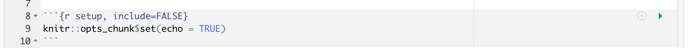

# Introduktion til R Markdown {#rmarkdown}

I dag begynder vi at arbejde med R Markdown. Selve emnet er relativt kort og er designet til, at du kan komme i gang med at bruge R Markdown i praksis, men notaterne referere også til nogle ekstra muligheder så du kan indrette dit dokument efter eget ønske. Der er to videoer - én er en 'quick-start guide' for at komme i gang, og den anden viser en simpel lineær regression i R Markdown - har du ikke brug for lidt genopfriskning, kan man også se mere om funktionaliten i R Markdown.

Efter quizzerne og problemstillinger er der en worksheet, hvor du kan øve dig videre med de typer opgaver vi kommer til at se i workshopperne. Fra næste gang (fredag) skifter vi emnet til visualiseringer i __ggplot2__, og vi arbejder naturligvis i R Markdown fremadrettet.

## Hvad er R Markdown?

R Markdown er både en nem og fleksibel måde at arbejde med R til projekter på. Her kan du kombinere din R-kode, output og tekst i samme dokument, og derudover fremviser et pænt HTML dokument fra det, som potentielt kan deles med andre. Jeg anbefaler at du bruger R Markdown til alle opgaverne i kurset og **ved eksamen forventer jeg at du afleverer et HTML dokument** til mig med din "knittede" kode fra din analyse. 

## Installere R Markdown

R Markdown er, ligesom R, gratis og ‘open source’. Den fungerer indenfor RStudio and kan installeres ved at bruge den følgende kommando:


```{r,eval=FALSE}
install.packages("rmarkdown")
```

## Videodemonstrationer

Jeg har lavet to videoer som kan ses her:

Video 1:

Jeg viser

* hvordan man laver et nyt dokument i R Markdown
* hvordan man skriver tekst ind i dokumentet
* hvordan man bruger "knit" til at lave et HTML-dokument
* hvordan man opretter og kører kode chunks

<!-- Link her hvis det ikke virker nedenunder: https://vimeo.com/541035944 -->

<!-- ```{r,echo=FALSE} -->
<!-- library("vembedr") -->

<!-- embed_url("https://vimeo.com/541035944") -->
<!-- ``` -->


Link her hvis det ikke virker nedenunder: https://vimeo.com/702416505

```{r,echo=FALSE}
library("vembedr")

embed_url("https://vimeo.com/702416505")
```

Video 2:

Jeg viser en kort lineær regression analyse:

* Indlæse datasæt og lave plot af datasættet
* Lynhurtig gennemgåelse af ligningen for rette linje 
* Hvordan man anvender funktionen `lm()` til at fitte en lineær model
* Fortolkelse af resultaterne

<!-- Link her hvis det ikke virker nedenunder: https://vimeo.com/541232690 -->

<!-- ```{r,echo=FALSE} -->
<!-- #library("vembedr") -->

<!-- embed_url("https://vimeo.com/541232690") -->
<!-- ``` -->

Link her hvis det ikke virker nedenunder: https://vimeo.com/701240044

```{r,echo=FALSE}
embed_url("https://vimeo.com/701240044")
```


## Oprette et nyt dokument i R Markdown

Man åbner et nyt rmarkdown dokument ved at trykke "New" > "New File" > "New R Markdown...". Man kan også trykke på "+" knappen øverst til venstre hjørne. 


Dernæst angiver man en titel (det kan ændres senere hvis der er bruge for det) og bekræfter, at outputtet kommer i HTML form. I kurset arbejdes der kun med HTML dokumenter, men man har også andre muligheder, som du er velkommen til at afprøve (PDF/Word/Shiny osv...).


<!-- YAML Header: Controls certain output settings that apply to the entire document. -->

### YAML

Den første sektion af dokument skrives i hvad der kaldes for 'YAML'. (Dette står for 'YAML Ain’t Markup Language').


Det indeholder oplysninger om dokumentet, og her kan man specificere forskellige muligheder - fk. titel, forfatter, output-type (fks. HTML eller PDF), dato, osv. I de fleste tilfælde nøjes vi med at bruge standard indstillinger, men hvis man gerne vil lære mere om de forskellige muligheder med YAML, kan man læse her:

https://bookdown.org/yihui/rmarkdown/html-document.html

eller se en liste af muligheder her på dette cheatsheet:

https://www.rstudio.com/wp-content/uploads/2016/03/rmarkdown-cheatsheet-2.0.pdf

### Globale options

Der er også tekst som ser ud som følgende:



Med funktionen `opts_chunk$set()` kan man specificere de globale indstillinger, som styrer hvordan det færdige dokument ser ud. I dette tilfælde er de fleste parametre angivet som 'default' (da de ikke er nævnt eksplicit), og `echo` er den eneste der har noget angivet. Hvis `echo` er `TRUE`, så betyder det, at når man "knitter" sin kode (processen, der få et HTML dokument frem, se nedenfor), så kan man også se koden, der blev kørt, samt dens output, i det færdige HTML dokument, der kommmer frem.  

## Skrive baseret tekst

Her er nogle brugbare muligheder for at skrive tekst i opgaverne eller rapporter:

```{r,eval=FALSE}
*italic*   **bold**

_italic_   __bold__
```

*italic*   **bold**

_italic_   __bold__

### Headers

Man kan også lave sektioner:

```{r,eval=FALSE}
# Header 1

## Header 2

### Header 3
```


### liste

```{r,eval=FALSE}
* Item 1
* Item 2
    + Item 2a
    + Item 2b
```

* Item 1
* Item 2
    + Item 2a
    + Item 2b

## Knitte kode

Man bruger *Knit* for at gengive filen i HTML form. Når man trykker på knappen *Knit*, bliver samtlige koder i filen kørt og et HTML dokument fremvises. Bemærk, at __koderne bliver kørt på ny hver gang man knitter__, uden hensyn til hvad du har i din nuværende workspace i RStudio. Det betyder, at hvis du eksempelvis har pakken `tidyverse` indlæst på din computer men har glemt at skrive `library(tidyverse)` eksplicit på toppen af dit dokument, så får du en fejlmeddelelse hvis du bruger tidyverse-baserede funktioner nogle steder.

## Kode chunks

Man skriver selve R kode indenfor hvad der kaldes for "chunks". Man kan oprette en ny chunk på flere måder - enten ved at trykke på den *Insert a new code chunk* knap ovenpå, eller ved at trykke *Cmd+Option+I* på tastaturet (hvis man bruger MAC) eller *Ctrl+Alt+I* (hvis man bruger Windows). Det er værd at huske den keyboard-shortcut - det sparer meget tid efter egen erfaring! 

Her er et eksempel af en chunk:

```{r}
# This is a chunk, let's write som R code
x <- 1
x + 1
```

For at køre en chunk, trykker man på den grønne pile øverste i højre hjørne på selve chunk (der hedder *Run Current Chunk* når du holder musen over den). Resultatet kan ses lige nedenunder, som i ovenstående.

Bemærk, at når du arbejde med dit R Markdown dokument er det generelt hurtigere at bruge den grønne pile / *Run Current Chunk* i stedet for at knitte hele dokumentet hver gang man vil køre kode. Det er fordi her kører man kun den enkel chunk i stedet for hele dokumentet på ny (herunder indlæsning af pakker og eventuelle store filer), som er tilfældet med *Knit*.

### Et godt råd når man arbejder med chunks

Til længere opgaver er det god praksis at sikre jævnligt, at man kan få et HTML dokument frem ved at knitte, selvom du kører din chunks lokalt mens du udvikler din kode - det vil sige, at du ikke få en alvorlig fejlmeddelelse, der forhindre din koder at knitte. __Det er dit ansvar at sikre, at din kode fungerer som helhed og du kan dermed producere et HTML dokument med din løsninger.__  

### Chunk indstillinger

I R Markdown er der mange muligheder for at styre hver eneste chunk i dit dokument - hvordan skal R håndtere koden med hensyn til evaluering og præsentering (især med hensyn til tabeller og plotter) af en bestemt chunk i dit dokument? Det kommer meget an på, hvem du gerne vil viser dit dokument til. For eksempel, i nuværende kursusnotater vil jeg gerne have generelt, at du ser alle min kode (en global indstilling), men nogle gange vil jeg foretrækker noget andet - en chunk som viser noget jeg ikke vil have kørt, eller ændre på størrelsen af et plotte i en bestemt chunk. For eksempel, en chunk med indstillingen `eval=FALSE` ser sådan ud (fjerne # symbol)

```{r,eval=FALSE}
#```{r,eval=FALSE}
#
#```
```

Her er nogle muligheder (sektionen "Embed code with knitr syntax"):

https://www.rstudio.com/wp-content/uploads/2016/03/rmarkdown-cheatsheet-2.0.pdf

Her er seks populær muligheder som jeg har kopiret fra nettet:

* `include = FALSE` 
  + prevents code and results from appearing in the finished file. R Markdown still runs the code in the chunk, and the results can be used by other chunks.
* `echo = FALSE` 
  + prevents code, but not the results from appearing in the finished file. This is a useful way to embed figures.
* `message = FALSE` 
  + prevents messages that are generated by code from appearing in the finished file.
* `warning = FALSE` 
  + prevents warnings that are generated by code from appearing in the finished.
* `fig.cap = "..."`
  + adds a caption to graphical results.
* `eval = FALSE`
  + does not evaluate the code


## R beregninger indenfor teksten i dokument ('inline code')

I nogle tilfælde vil man køre R kode "inline", det vil sige, direkte indenfor teksten, ekempelvis indenfor en sætning. Dette gøres ved at skrive på følgende måde:

```{r,eval=FALSE,tidy=FALSE}
Her er min `kode`
```

Ovenstående ser sådan ud når skrevet direkte indenfor teksten:

Her er min `kode` 

I dette tilfælde, er der ikke noget R kode som er blevet kørt. Hvis man vil køre R kode indenfor teksten skriver man (for eksempel):

```{r,eval=FALSE,tidy=FALSE}
De gennemsnitlige antal af observationer er `r mean(c(5,7,4,6,3,3))`
```

Ovenstående ser sådan ud når skrevet direkte indenfor teksten:

De gennemsnitlige antal af observationer er `r mean(c(5,7,4,6,3,3))`

Og bemærk, at hvis man glemmer 'r', så bliver koden ikke kørte:

```{r,eval=FALSE,tidy=FALSE}
De gennemsnitlige antal af observationer er `mean(c(5,7,4,6,3,3))`
```

giver:

De gennemsnitlige antal af observationer er `mean(c(5,7,4,6,3,3))`

Brugen af kode inline kan være en kæmpe fordel når man gerne vil skrive noget om an analyse, hvor man referere til forskellige statistik beregninger som man har beregnet i R (eksempelvis en middelværdi eller p-værdi). Hvis man skriver eller kopier et tal direkte og datasættet eller analysemetoden ændre sig på en eller anden grund, så bliver beregningerne indenfor teksten ikke opdateret, og så risikerer man at have en fejl i den endelige rapport. Bruger man inline code, så er beregningerne opdateret automatiske, uden at tænke over det.

## Working directory

Bemærk at den måde man sætter en working directory er ændleredes i R Markdown i forhold til base-R. Hvis man bruger `setwd()` i en chunk, sætter man kun den working directory i den pågælende chunk og ikke i de efterfølgende chunks.

I R Markdown er standarden (default), at din working directory er mappen som du gemmer din .Rmd fil. Hvis du genre vil bruge noget andet, kan du tilføje `knitr::opts_knit$set(root.dir = '/tmp')` til din globale indstillinger chunk på toppen af din fil, hvor `'/tmp'` skal ændres til din ønskede mappe.


````md
```{r, setup, include=FALSE}`r ''`
knitr::opts_knit$set(root.dir = '/tmp')
```
````

## Matematik

Man kan også skrive matematik (Latex) i R Markdown - eksempelvis `$\int_0^5 x^2 dx$` vil ser ud som $\int_0^5 x^2 dx$ i dit HTML dokument. Jeg forventer ikke at du lære Latex men det er af og til brugbart - for eksempel en rette linje ligning er `$y = 3.4x + 2.1$` giver $y = 3.4x + 2.1$ eller en hypotese: `$H0: \mu = 0$` giver $H0: \mu = 0$. Det er op til dig hvor meget du bruger matematik måde i dine egne dokumenter.

## Problemstillinger

1) Der er en kort __quiz__ i Absalon, som hedder "Quiz - R Markdown".

2) Lav et nyt R Markdown dokument i RStudio. Prøve at lave en list og nogle overskrifter i forskellige størrelser.

3) Nu tryk på `Knit` knappen og tjek at et HTML-dokument fremvises på din skærm.

4) Rediger på titlen (den er en del af din YAML-header oppe på toppen af din fil) - kald dit dokument for "My first R Markdown document", og tryk på `Knit` igen for at se ændringen i dit HTML dokument.

5) Opret en ny R-chunk, og tilføj noget kode, eksempelvis

```{r,eval=FALSE}
x <- rnorm(20,1,2) #make a sample of normally distributed data
plot(x)
```

* husk shortcut CMD+OPT+I eller CTRL+WIN+I når man oprette en chunk (det sparer tid)
* tryk på den grønne pile
* prøve også at køre en linjen ad gangen med CMD+Enter/CTRL+Enter
* lav flere chunks med adskillige kode som du vælger
* tryk på knit og bemærk, at det tager længere tid at `knit` hver eneste gang man ændre noget, end når man bare kører chunks individ indenfor dit dokument

6) Tryk på "hjulen"-knappen i øverste højre hjørne af en af din chunks og prøv at ændre på de forskellige chunk indstillinger. Tryk på 'knit' for at se, hvad der sker. 

7) Hver gang du knitter, du lave et HTML dokument. Nu prøv at lave en andet type dokument i stedet for - erstatte `html_document` med `word_document` i YAML (toppen af din .Rmd fil)
  
  * Se her for endnu flere muligheder: https://bookdown.org/yihui/rmarkdown/output-formats.html 

8) Tilføj følgende chunk til dit dokument og tryk på "knit". Få du en fejlmedelse?

```{r,eval=FALSE}
data(mtcars)
mtcars %>% filter(cyl==6)
```

Bemærk, at du får en fejlmeddelse fordi, du endnu ikke har indlæst den påkrævet pakke til at få koden til at virke. Det kan ske, selvom du måske har indlæste pakken i Console eller i Packages tab. 

* Først prøve at køre "library(tidyverse)" indenfor Console og dernæst prøve at knitte dit dokument igen - du får stadig en fejmeddelse.
* Tilføj `library(tidyverse)` __øverst i din chunk__. Nu bør dit dokument knitte.

9) Erstat linjen `output: html_document` med følgende i din YAML metadata oppe i toppen af din .Rmd fil:

```yaml
output:
  html_document:
    code_folding: hide
```

Knit og se hvad, der sker. 

* Erstat `hide` med `show` og kig på forskellen. 

10) Brug `$ $` til at skrive en ligning ind i teksten i din .Rmd fil. Prøv for eksempel `$\bar{x}_{i} = \frac{1}{n}\sum_{i=1}^{n} x_{i}$` og knitte dit dokument for at tjekke, om du får formlen til middelværdien.

11) (**Worksheet**) Ind på Absalon har jeg lagt en R Markdown (.Rmd) fil som hedder "R Markdown opgave", som du kan bruge til at starte med at arbejde med R Markdown baserede opgaver. Det kombinerer koncepter fra det forudgående kapitel om de grundlæggende ting i R og statistik.

## Færdig for i dag og næste gang

Husk at sende mig eventuelle spørgsmål, som jeg kan svare på enten direkte eller i forelæsning næste gang. Næste gang begynder vi at arbejde vi med R-pakken `ggplot2`, der bruges til at lave høj kvalitet visualiseringer fra datasæt.

## Ekstra links

* Her er en 'quick tour' https://rmarkdown.rstudio.com/authoring_quick_tour.html

* Handy R Markdown Cheatsheet: RStudio has published numerous cheatsheets for working with R, including a detailed cheatsheet on using R Markdown! The R Markdown cheatsheet can be accessed from within RStudio by selecting _Help > Cheatsheets > R Markdown Cheat Sheet_.
